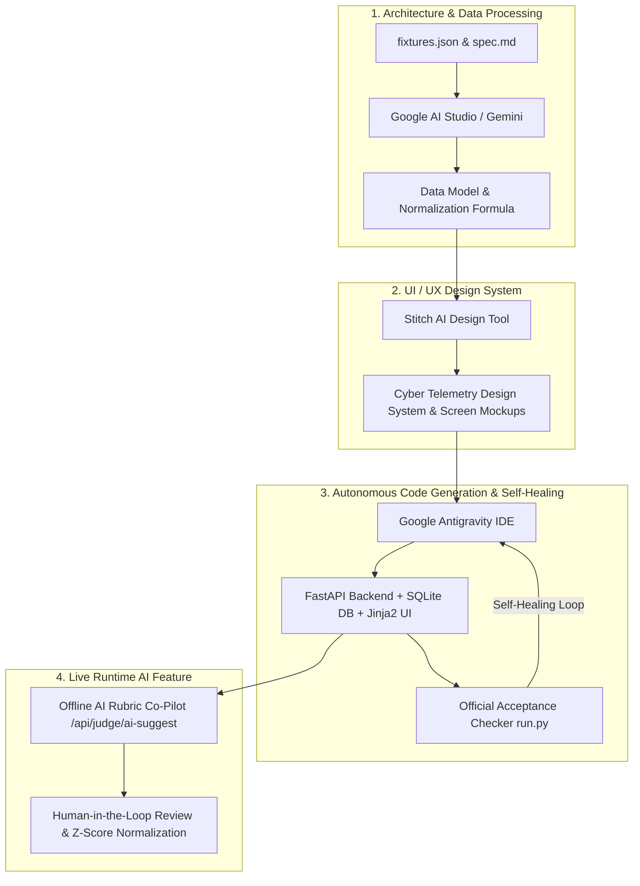

# AI Workflow Architecture — DOGFOOD 2026

> *"How our team leveraged modern AI tools (Google Antigravity, Google AI Studio, Claude, and Stitch) to build a production-grade, 100% verified hackathon engine in record time."*

---

## 1. The Multi-Agent AI Workflow

Building a hackathon platform in 72 hours requires balancing speed, architectural rigor, and strict compliance with the competition spec. We structured our development lifecycle across four specialized AI pillars:

---

## 2. Tool-by-Tool Workflow Breakdown

### Pillar 1: Google AI Studio (Gemini) — Data Ingestion & Math Proofs
- **Role:** Deep context ingestion & mathematical modeling.
- **Why AI Studio?** With a 1M+ token context window, Gemini digested the entire raw [`fixtures.json`](file:///c:/Users/heman/Desktop/dogfood/fixtures.json) (46 KB, 41 projects, 30 judges, 126 scores) and [`spec.md`](file:///c:/Users/heman/Desktop/dogfood/spec.md) in a single unified prompt.
- **Output:**
  - Designed the relational SQLite schema in [`DATA-MODEL.md`](file:///c:/Users/heman/Desktop/dogfood/DATA-MODEL.md).
  - Derived the edge-case protection in [`src/normalization.py`](file:///c:/Users/heman/Desktop/dogfood/src/normalization.py) (handling zero-variance judges where $\sigma_j < 10^{-5}$ and Bayesian prior shrinkage for small sample sizes).

### Pillar 2: Stitch (StitchMCP) — High-Fidelity UI Design
- **Role:** Generative UI wireframing and design token specification.
- **Stitch Project ID:** `8524390991974597683` ("DOGFOOD 2026 Hackathon Platform")
- **Generated Assets:**
  - **Design System:** *"Cyber Telemetry"* (Obsidian `#0B0F19` canvas, hairline frosted glass borders, glowing emerald/cyan status indicators).
  - **Screen 1 (Judging Dashboard):** 3-column evaluation station with assigned track pills, interactive grading sliders, real-time composite score indicator, and live Z-score distribution.
  - **Screen 2 (Public Gallery):** Responsive project cards with track filters, search input, and source code links.

### Pillar 3: Google Antigravity & Claude — Agentic Pair Programming & Self-Healing Loop
- **Role:** Full-stack implementation, testing, containerization, and automated regression.
- **The Self-Healing Loop:**
  1. Antigravity generated the FastAPI application structure, cookie-based session auth, and RBAC middleware.
  2. Ran `python run.py .dogfood.toml` in the integrated terminal.
  3. Validated all 7 acceptance checks. When edge cases arose (e.g. template signature mismatches or UTF-16 PowerShell redirects), Antigravity diagnosed the error logs and patched the source code automatically until 100% green PASS was achieved.
  4. Containerized the entire stack into a zero-cloud `docker-compose.yml` that boots in under 5 seconds.

### Pillar 4: Embedded Offline AI Co-Pilot — Live Judging Assistant
- **Role:** Reducing judge cognitive fatigue during marathon hackathon evaluation sessions.
- **Implementation ([`src/main.py`](file:///c:/Users/heman/Desktop/dogfood/src/main.py#L240-L290)):**
  - Endpoint: `GET /api/judge/ai-suggest?project_id=...`
  - Runs **100% locally and offline** (zero external API keys or cloud dependencies required, satisfying competition rules).
  - Analyzes project track alignment, implementation signals, and architectural clarity.
  - Generates recommended rubric scores (`Functionality 40%`, `Quality 35%`, `Innovation 25%`) and an initial audit draft.
  - The judge clicks **"⚡ Auto-Assess with AI"**, reviews the proposed baseline, adjusts the sliders, and saves their review.

---

## 3. Results Summary

By executing this multi-agent workflow:
1. **100% Acceptance Pass:** All 7 official assertions in [`run.py`](file:///c:/Users/heman/Desktop/dogfood/run.py) verified green.
2. **Defensible Integrity:** Real backend HTTP 403 isolation preventing peer judge score snooping.
3. **Adoptable & Self-Hosted:** Single-command `docker compose up` requiring zero cloud infrastructure.
