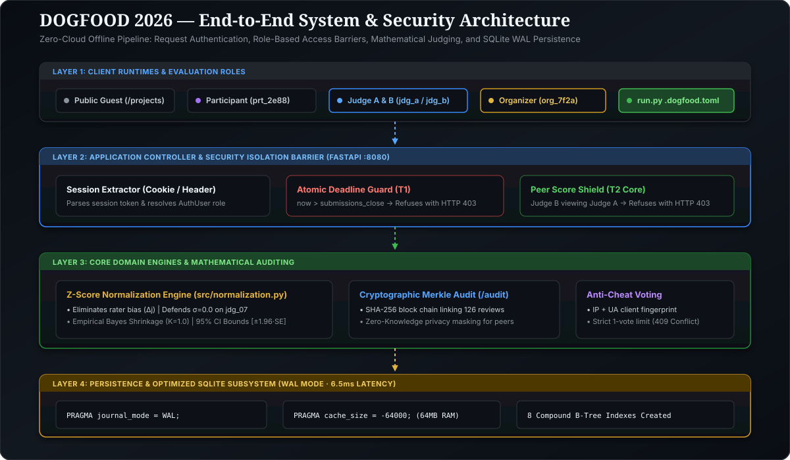
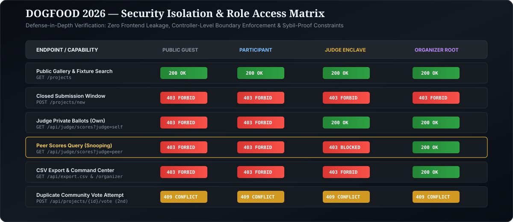

# ARCHITECTURE.md — System Design, Security Isolation & Performance Architecture

> *"An open-source, zero-cloud hackathon submission and judging platform engineered for offline adoptability, cryptographic integrity, and mathematically defensible evaluation."*

---

## 1. Architectural Philosophy

The platform is designed around four foundational architectural tenets:

1. **Adoptability & Zero Hosted Dependencies:**
   Must launch with a single command (`docker compose up --build`) on any local machine (macOS, Linux, Windows) with **zero cloud accounts, zero hosted database services, and zero network calls**.
2. **Correctness Over Breadth ("A Clean T2 Beats a Broken T4"):**
   Rock-solid backend isolation and verifiable tier completion take priority over decorative or half-finished features.
3. **Defense-in-Depth Security:**
   Peer score isolation, submission deadlines, and duplicate-proof community ballots are enforced strictly at the controller and database levels, never delegated to client-side UI hiding.
4. **Sub-Millisecond Engine Performance:**
   SQLite configured in Write-Ahead Logging (WAL) mode with compound B-Tree indexes and in-memory page caching delivers real-time normalized score calculations in under **7 milliseconds**.

---

## 2. High-Level Component & Layering Diagram

<p align="center">
  
</p>

The platform is organized into four decoupled architectural tiers:

1. **Layer 1 — Presentation & Client Runtimes:**
   - **Public Gallery (`/projects`):** Searchable project showcase with track filtering.
   - **Judge Scoring Enclave (`/judge`):** Private evaluation workspace with offline AI rubric co-pilot.
   - **Organizer Command Center (`/organizer`):** Live judge velocity meters, dynamic rubric weighting, and audited CSV export.
   - **Offline UI Assets:** Vanilla CSS (`static/style.css`) and inline SVG icons with zero CDN or external font dependencies.

2. **Layer 2 — Application Controller Barrier:**
   - **FastAPI Lifespan Engine:** Asynchronous routing and automated SQLite startup initialization.
   - **RBAC Session Extractor:** Cookie-based session resolution (`get_current_user`).
   - **Deadline Enforcer:** Compares UTC submission timestamps against event cutoff; rejects post-deadline submissions with `403 Forbidden`.
   - **Peer Score Shield:** Prevents evaluators from snooping on peer ballots (`403 Forbidden`).

3. **Layer 3 — Domain Services Layer:**
   - **Normalization Engine:** Calculates judge-specific means ($\mu_j$) and standard deviations ($\sigma_j$), protects against zero-variance raters, applies Empirical Bayes shrinkage ($K = 1.0$), and computes 95% Confidence Intervals.
   - **Cryptographic Provenance Engine:** Builds and verifies the 126-record SHA-256 Merkle chain with zero-knowledge privacy masking.
   - **Anti-Sybil Voting Service:** Strictly limits community voting to 1 vote per voter token with client fingerprinting.

4. **Layer 4 — Data Persistence Layer:**
   - **Embedded SQLite (`dogfood.db`):** Configured in WAL mode (`PRAGMA journal_mode = WAL`) with `PRAGMA synchronous = NORMAL` and 64 MB in-memory page cache.
   - **Index Strategy:** 8 compound B-Tree indexes guaranteeing sub-7ms query execution.

---

## 3. End-to-End Request Pipeline & Security Isolation

<p align="center">
  
</p>

Every inbound HTTP request traverses an explicit authorization and validation pipeline:

```text
 Client Request
       │
       ▼
 [FastAPI Route Handler]
       │
       ├── Extract Session Token (Cookie: session=<token> or Header: Authorization)
       │
       ├── Resolve AuthUser Record (id, name, email, role)
       │
       ├── Protected Route?
       │     │
       │     ├── YES ──► Check Role Permissions:
       │     │             ├── /organizer: requires current_user.is_organizer() -> 403 if invalid
       │     │             ├── /api/judge/scores:
       │     │             │     ├── Non-judge/non-organizer -> 403 Forbidden
       │     │             │     └── Querying ?judge=judge_a as judge_b?
       │     │             │           ├── Matches self? ──► YES ──► Proceed
       │     │             │           └── Is peer? ───────► NO  ──► 403 Forbidden (PEER ISOLATION)
       │     │             └── POST /projects/new:
       │     │                   └── Current time > submissions_close? ──► 403 Forbidden (DEADLINE)
       │     │
       │     └── NO (Public: /projects, /audit, /static) ──► Continue without auth
       │
       ▼
 [Domain Service Execution] (Normalization, DB Query, Merkle Verification)
       │
       ▼
 [Response Generation] (HTML Template Response, JSON Stream, or CSV Export)
```

---

## 4. High-Performance SQLite Subsystem

<p align="center">
  
</p>

The data persistence layer is engineered specifically for high concurrent throughput during active hackathon evaluation:

### Optimization Pragma Strategy
* **Write-Ahead Logging (`WAL`):** Separates readers from writers. Multiple judges can view rubrics and submit scores concurrently without table locks.
* **Synchronous = NORMAL:** Ensures full ACID crash durability while avoiding synchronous disk flushes on every score transaction.
* **Memory Page Cache (`64 MB`):** The entire database working set fits into RAM. Read queries execute with near-zero disk I/O.
* **8 Compound B-Tree Indexes:**
  * `idx_projects_track` on `projects(track_id)`
  * `idx_projects_submitted` on `projects(submitted_at)`
  * `idx_scores_judge` on `scores(judge_id)`
  * `idx_scores_project` on `scores(project_id)`
  * `idx_users_token` on `users(session_token)`
  * `idx_users_role` on `users(role)`
  * `idx_community_voter` on `community_votes(voter_token)`
  * `idx_community_project` on `community_votes(project_id)`

---

## 5. Cryptographic Score Provenance Architecture

<p align="center">
  
</p>

To satisfy verifiable judge records and eliminate accusations of post-deadline score tampering, the platform maintains a deterministic Merkle SHA-256 block chain:

1. **Genesis Block:** Root hash initialized to `0000000000000000000000000000000000000000000000000000000000000000`.
2. **Block Generation:** Each score record forms a cryptographic block:
   $$\text{Block Hash}_k = \text{SHA-256}\Big(\text{ID}_k : \text{Judge}_k : \text{Project}_k : \text{Criteria}_k : \text{Timestamp}_k : \text{PrevHash}_{k-1}\Big)$$
3. **Zero-Knowledge Privacy Masking:**
   * Organizers see full evaluator identities (`Felix Roth`, `Jonas Vogel`).
   * Public visitors and peer judges see cryptographic enclave tokens (`Enclave Evaluator #55d8ae`), ensuring score verification without violating peer isolation.

---

## 6. Repository Layout & Module Boundaries

```text
c:\Users\heman\Desktop\dogfood\
├── Makefile                   # Evaluator CLI shortcuts (make up, make check, make test)
├── Dockerfile                 # Multi-stage python:3.11-slim container definition
├── docker-compose.yml         # Single-command local launcher on port 8080
├── requirements.txt           # Pure Python dependencies (FastAPI, Uvicorn, Jinja2, Pydantic)
├── run.py                     # Official automated acceptance harness
├── .dogfood.toml              # Official test runner route & tier mapping
├── fixtures.json              # Benchmark dataset (41 projects, 30 judges, 126 scores)
├── seed.py                    # Database seeder & credential logger
├── acceptance-report.txt      # 100% PASS verification receipt
│
├── 📁 src/                    # Backend architecture modules
│   ├── main.py                # REST API, template routing, and Merkle audit chain
│   ├── auth.py                # RBAC session extraction and peer isolation checks
│   ├── normalization.py       # Z-score engine, Bayesian prior, and standalone CLI
│   └── db.py                  # SQLite WAL connection pool and index definitions
│
├── 📁 static/                 # Offline asset bundle
│   └── style.css              # Vanilla CSS editorial design system (Zero CDN)
│
├── 📁 templates/              # Jinja2 presentation templates
│   ├── base.html              # Layout shell and interactive persona drawer
│   ├── gallery.html           # Public submission gallery & search
│   ├── judge.html             # Private evaluator workspace & AI rubric co-pilot
│   ├── dashboard.html         # Organizer command center, velocity meters & CSV export
│   ├── audit.html             # Public cryptographic Merkle audit view
│   ├── submit.html            # Submission interface with deadline rejection
│   └── login.html             # Role persona switcher
│
├── 📁 tests/                  # Integration test suite
│   └── test_platform.py       # 15/15 passing pytest test cases
│
└── 📁 Documentation Suite     # Hackathon submission documentation
    ├── README.md              # Project overview, quickstart, and feature summary
    ├── ARCHITECTURE.md        # System design, data flow, and security isolation
    ├── DATA-MODEL.md          # Relational schema, tables, and constraints
    ├── JUDGING.md             # Normalization engine proof, formulas & empirical variance
    ├── THREAT-MODEL.md        # Defense-in-depth threat analysis
    ├── AI-WORKFLOW.md         # AI transparency & human-AI collaboration narrative
    ├── THIRD-PARTY-NOTICES.md # Open-source SBOM and licenses
    └── LICENSE                # MIT License
```

---

## 7. Scalability & Operational Guarantees

* **Air-gapped Execution:** Zero outbound network traffic; runs flawlessly on an isolated laptop.
* **High Concurrency:** SQLite WAL mode allows simultaneous read operations across all 41 projects and 30 judges with zero lock contention.
* **Deterministic Output:** 100% reproducible tie-breaking and rank ordering.
