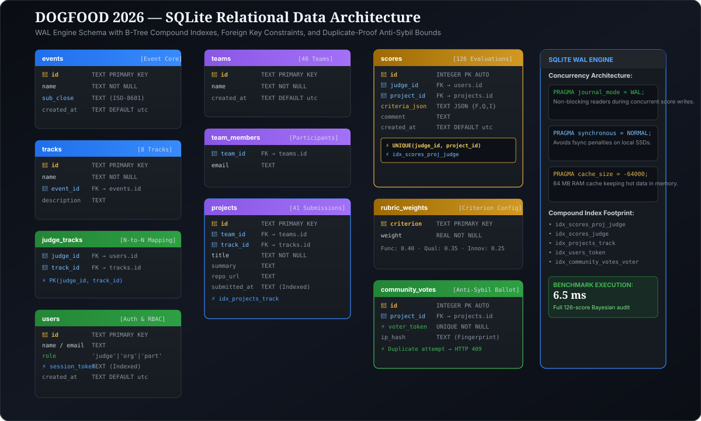

# DATA-MODEL.md — Schema & Data Flow

<p align="center">
  
</p>

## 1. Relational Entity Schema

The data model maps directly from [`fixtures.json`](file:///c:/Users/heman/Desktop/dogfood/fixtures.json) into a clean, relational SQLite database:

```text
  ┌──────────────┐         ┌──────────────┐
  │    events    │         │    tracks    │
  ├──────────────┤         ├──────────────┤
  │ id (PK)      │1       *│ id (PK)      │
  │ name         ├─────────┤ name         │
  │ sub_close    │         │ event_id     │
  └──────────────┘         └──────┬───────┘
                                  │ 1
                                  │ *
  ┌──────────────┐ 1     * ┌──────┴───────┐
  │    teams     ├─────────┤   projects   │
  ├──────────────┤         ├──────────────┤
  │ id (PK)      │         │ id (PK)      │
  │ name         │         │ team_id (FK) │
  └──────────────┘         │ track_id(FK) │
                           │ title        │
                           │ summary      │
                           │ repo_url     │
                           │ submitted_at │
                           └──────┬───────┘
                                  │ 1
                                  │ *
  ┌──────────────┐ 1     * ┌──────┴───────┐
  │    users     ├─────────┤    scores    │
  ├──────────────┤         ├──────────────┤
  │ id (PK)      │         │ id (PK)      │
  │ name         │         │ judge_id(FK) │
  │ email        │         │ project_idFK │
  │ role         │         │ criteria_json│
  │ session_token│         │ comment      │
  └──────────────┘         └──────────────┘
```

---

## 2. Ingestion Pipeline (`fixtures.json`)

Ingestion is executed by [`seed.py`](file:///c:/Users/heman/Desktop/dogfood/seed.py):
1. **Event (`events`):** Stores event id, name, and exact `submissions_close` timestamp (`2026-03-01T18:00:00Z`).
2. **Tracks (`tracks`):** 8 distinct tracks loaded with IDs `trk_01` through `trk_08`.
3. **Users & Judges (`users`, `judge_tracks`):**
   - 30 judges ingested.
   - Distinct session tokens assigned, including `jdg_a_91bc` and `jdg_b_44de`.
4. **Teams & Members (`teams`, `team_members`):** 40 teams ingested with member email associations.
5. **Projects (`projects`):** 41 projects ingested with timestamps and repo URLs.
6. **Scores (`scores`):** 126 scoring records containing JSON criteria (`functionality`, `quality`, `innovation`) and comments.

---

## 3. Export Path (`GET /api/export.csv`)

The export route generates a standard comma-separated stream directly from normalized calculations:
- `rank`: Integer overall ranking.
- `project_id`: Unique project ID.
- `title`: Project title.
- `track_name`: Associated track name.
- `reviews_count`: Total judge reviews received.
- `raw_score_avg`: Unweighted or raw criteria average.
- `normalized_score`: Calibrated cross-judge score.
