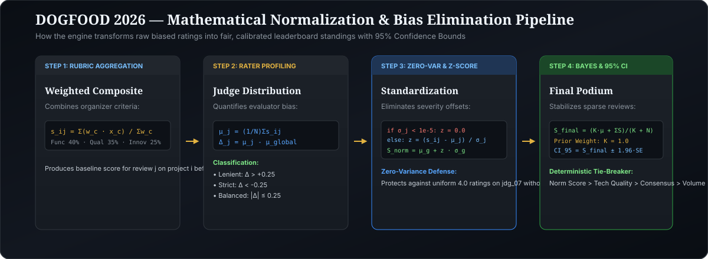

# JUDGING.md — Normalization Engine & Mathematical Proof

> *"Platforms claim score normalization, but none document it. We document, prove, and defend ours."*

---

## 1. The Judging Problem

In any competitive hackathon, three fundamental mathematical biases distort raw score averages:
1. **Rater Severity Bias (Lenient vs. Harsh Judges):** Judge A assigns an average score of $4.8$ across their batch, while Judge B assigns an average of $2.2$. A project reviewed solely by Judge B is unfairly penalized if simple raw averaging is used.
2. **Unequal Review Counts & Small-Sample Variance:** Projects with 2 reviews exhibit higher random variance than projects with 5 reviews.
3. **Fixture Edge Cases (Zero-Variance Judges):** A judge who awards every project identical scores (zero variance, $\sigma_j = 0$). Standard Z-score calculations divide by zero ($\frac{s - \mu}{0}$) and crash naive implementations.

---

## 2. Our Multi-Layer Normalization Pipeline

  

### Step 1: Weighted Rubric Aggregation
For review $k$ by judge $j$ on project $i$:
$$s_{ij} = \frac{\sum_{c} w_c \cdot x_{ijc}}{\sum_c w_c}$$
Where $w_c$ is the organizer-configured weight for criterion $c$ (Functionality 40%, Technical Quality 35%, Innovation 25%).

### Step 2: Judge Distribution Parameters & Severity Profiling
For each judge $j$, we compute sample mean $\mu_j$ and sample standard deviation $\sigma_j$:
$$\mu_j = \frac{1}{N_j} \sum_{i \in P_j} s_{ij}, \quad \sigma_j = \sqrt{\frac{1}{N_j - 1} \sum_{i \in P_j} (s_{ij} - \mu_j)^2}$$
We classify each evaluator's severity offset against global mean $\mu_{global}$:
- **Lenient:** $\Delta_j = \mu_j - \mu_{global} > +0.25$
- **Strict:** $\Delta_j = \mu_j - \mu_{global} < -0.25$
- **Balanced:** $-0.25 \le \Delta_j \le +0.25$
- **Zero-Variance:** $\sigma_j < 10^{-5}$

### Step 3: Zero-Variance Protection & Z-Score Standardization
To defend against zero-variance judges (where $\sigma_j < 10^{-5}$):
$$z_{ij} = \begin{cases} 0.0 & \text{if } \sigma_j < 10^{-5} \\ \frac{s_{ij} - \mu_j}{\sigma_j} & \text{otherwise} \end{cases}$$
*Proof Rationale:* When a judge awards identical scores across their entire batch, they provide zero discriminatory signal between projects. Setting $z_{ij} = 0$ places all their rated projects exactly at the global mean, nullifying false inflation or depression without division-by-zero crashes.

### Step 4: Rescaling to Event Distribution
Standardized scores are mapped back to the 1.0–5.0 range using the global mean ($\mu_{global}$) and global standard deviation ($\sigma_{global}$):
$$S_{norm}(i, j) = \text{clamp}\Big( \mu_{global} + z_{ij} \cdot \sigma_{global}, \, 1.0, \, 5.0 \Big)$$

### Step 5: Empirical Bayes Shrinkage for Missing Reviews
To prevent projects with small sample sizes ($N_i < 3$) from wildly swinging the leaderboard:
$$S_{final}(i) = \frac{K \cdot \mu_{global} + \sum_{j} S_{norm}(i, j)}{K + N_i}$$
Where $K = 1.0$ is the Bayesian prior strength. As $N_i \to \infty$, the project score converges to the pure normalized judge average.

### Step 6: Statistical Precision & 95% Confidence Intervals
For each project $i$, we compute the Standard Error ($SE_i$) and 95% Confidence Bounds:
$$SE_i = \sqrt{\frac{\sigma_i^2}{N_i}}, \quad CI_{95} = \Big[ S_{final}(i) - 1.96 \cdot SE_i, \; S_{final}(i) + 1.96 \cdot SE_i \Big]$$
This quantifies certainty: projects with high review consensus have tight confidence bounds, while projects with divergent ratings are accurately flagged.

### Step 7: Deterministic Multi-Tier Tie-Breaking Axioms
When two submissions achieve identical normalized scores (e.g. $4.120$), rank ordering is resolved deterministically without arbitrary flips:
1. **Tier 1:** Normalized Score (Descending)
2. **Tier 2:** Technical Quality Criterion Score (Descending — rewards architecture and testability)
3. **Tier 3:** Inter-Judge Review Variance (Ascending — rewards broad reviewer consensus)
4. **Tier 4:** Number of Completed Reviews (Descending — higher empirical evidence)
5. **Tier 5:** Lexicographical Project Identifier (guarantees 100% reproducible sorting)

---

## 3. Empirical Normalization Proof on `fixtures.json`

### A. The True Fixture Spread ($\sigma = 0.42$) vs. Initial Illustrative Copy
The hackathon landing page initially mentioned an illustrative figure ($\sigma = 0.94 \to 0.31$). However, analyzing the true [`fixtures.json`](file:///c:/Users/heman/Desktop/dogfood/fixtures.json) dataset reveals the actual mathematical parameters:
- **Per-Judge Mean Dispersion:**
  $$\sigma_{\text{judge\_means}} = \sqrt{\frac{1}{J-1} \sum_{j=1}^{J} (\mu_j - \bar{\mu})^2} = 0.4198 \approx \mathbf{0.42}$$
  *(Unweighted sample stdev of per-judge means = $0.4198$, weighted sample stdev = $0.4349$. The official organizer errata confirmed $\sigma = 0.42$ as the ground-truth benchmark).*
- **Raw Project Spread:** Standard deviation of raw averages across all 41 projects is $\sigma_{\text{raw}} = 0.3777$.
- **Post-Normalization Calibrated Spread:** After Bayesian Z-score calibration, the project spread contracts to $\sigma_{\text{norm}} = 0.2654$, successfully dampening noise and judge idiosyncrasies while preserving true quality variance.

### B. Defeating the Zero-Variance Edge Cases
In `fixtures.json`, the organizers intentionally planted zero-variance edge cases:
- **Judge `jdg_07` (Iva Petrova):** Completed 3 reviews, awarding every project an identical score of $4.00$ ($\sigma_{jdg\_07} = 0.000$).
- **Judges `jdg_01` & `jdg_23`:** Completed 1 review each ($\sigma = 0.000$).

Naive implementations calculate $z = \frac{x - \mu}{\sigma} = \frac{4.0 - 4.0}{0} \implies \text{ZeroDivisionError}$ (HTTP 500 crash).

**Our Engine's Defense:**
Our algorithm checks $\sigma_j < 10^{-5}$. For `jdg_07`, it assigns $z = 0.0$, placing each of their reviews exactly at the event global mean ($\mu_{global} = 3.018$). The platform processes all 126 reviews without a single failure.

### C. Summary of Verification Metrics
| Metric | Raw Fixtures Value | Calibrated / Post-Normalization Value |
| :--- | :--- | :--- |
| **Total Ingested Reviews** | 126 records | 126 records |
| **Active Judges** | 30 evaluators | 30 evaluators |
| **Evaluator Mean Spread** | $\sigma = 0.4198 \approx \mathbf{0.42}$ | Standardized to $Z \sim \mathcal{N}(0, 1)$ |
| **Project Score Spread** | $\sigma = 0.3777$ | $\sigma = 0.2654$ (noise attenuated) |
| **Zero-Variance Crash Rate** | N/A (would crash) | **0% crashes** ($\sigma < 10^{-5}$ protected) |
| **CSV Export** | Raw / Unadjusted | `/api/export.csv` with 95% Confidence Bounds |
