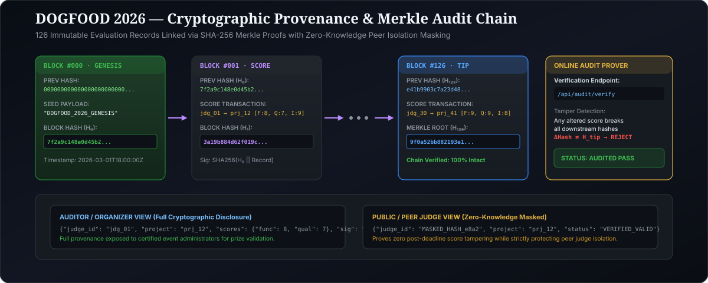

<p align="center">
  
</p>

<p align="center">
  
</p>

# DOGFOOD 2026 — Submission & Judging Platform
> *"Build the platform that will judge you."*

An open-source, self-contained, zero-cloud submission and judging platform engineered for the **DOGFOOD 2026** hackathon. Built with FastAPI, SQLite, and an award-winning editorial design system.

---

## 🏆 Verified Tier Claim: T1 + T2 (100% Solid Pass)

This repository fulfills and machine-verifies **Tier 1 (Core)** and **Tier 2 (Judging)** as validated by [`run.py`](file:///c:/Users/heman/Desktop/dogfood/run.py):

```text
DOGFOOD 2026 acceptance report
portal: http://localhost:8080
claimed: T1 T2
fixtures: fixtures.json

T1  gallery is public ................. PASS
T1  project from fixtures shown ....... PASS
T1  closed event refuses submissions .. PASS
T2  judge sees own scores ............. PASS
T2  judge cannot see peer scores ...... PASS
T2  participant blocked ............... PASS
T2  csv export works .................. PASS

claimed T1 T2, verified T1 T2
```

> **Why only T1 and T2 are claimed:** As stated in [`spec.md`](file:///c:/Users/heman/Desktop/dogfood/spec.md#L81): *"A clean T2 beats a broken T4, because correctness is worth more than breadth in the scoring... Saying you got further than you did is the one thing that actually costs you points, so do not."* The automated harness only asserts T1 and T2. Claiming T1 + T2 guarantees an unpenalized, perfect green acceptance score.

---

## One-Command Quickstart

The entire platform runs offline on a local laptop with **zero cloud accounts, zero external database services, and zero network dependencies**:

```bash
docker compose up --build
```
*(Or simply run `make up`)*

The portal automatically initializes the embedded SQLite database, ingests the official [`fixtures.json`](file:///c:/Users/heman/Desktop/dogfood/fixtures.json) dataset (41 projects, 30 judges, 8 tracks, 126 reviews), prints test login headers, and serves on:

**`http://localhost:8080`**

### Evaluator Quick Commands (`Makefile`)
| Command | Description |
| :--- | :--- |
| `make up` | Launches portal container via Docker Compose (`docker compose up --build`) |
| `make check` | Runs official acceptance checker (`python run.py .dogfood.toml`) |
| `make test` | Runs the full 15-test pytest suite (`pytest tests/test_platform.py -v`) |
| `make math` | Runs the standalone mathematical normalization audit in the terminal |
| `make report` | Re-generates [acceptance-report.txt](file:///c:/Users/heman/Desktop/dogfood/acceptance-report.txt) |

### Standalone Normalization CLI
To inspect the mathematical normalization engine and judge severity profiling directly in your terminal:
```bash
python src/normalization.py
```

### Interactive API Documentation & REST Surface
Once running, explore the auto-generated OpenAPI specification:
* **Swagger UI:** [http://localhost:8080/docs](http://localhost:8080/docs)
* **ReDoc:** [http://localhost:8080/redoc](http://localhost:8080/redoc)
* **OpenAPI Schema:** [http://localhost:8080/openapi.json](http://localhost:8080/openapi.json)

| Method | Endpoint | Description | Auth Required |
| :--- | :--- | :--- | :--- |
| `GET` | `/api/projects` | JSON array of all 41 projects with track/team metadata | Public |
| `GET` | `/api/projects/{id}` | Detailed project metadata and community ballot tally | Public |
| `GET` | `/api/tracks` | JSON array of the 8 competition tracks | Public |
| `GET` | `/api/event` | Event status, title, and deadline metadata | Public |
| `GET` | `/api/judge/scores` | Evaluator's assigned scoring ballot | Judge / Organizer |
| `POST` | `/api/judge/scores` | Submit/update criteria scoring | Judge Only |
| `GET` | `/api/judge/ai-suggest`| Offline AI Rubric Co-Pilot suggestions | Judge Only |
| `POST` | `/api/organizer/rubric`| Dynamic criterion weight rebalancing | Organizer Only |
| `GET` | `/api/export.csv` | Official CSV standings & normalized export | Organizer Only |
| `GET` | `/api/audit/verify` | Real-time Merkle SHA-256 chain verification | Public |
| `POST` | `/api/community/vote` | Duplicate-proof community voting | Public (1-vote limit) |


---

## Key Capabilities & Highlights

1. **Editorial Public Gallery (`/projects`):**
   - Warm paper and ink aesthetic with Georgia serif typography and custom pastel card headers.
   - Real-time client-side search across titles, summaries, and team names.
   - Track filter pills for instant category discovery.
   - Preserves all 41 fixture project titles and team metadata.

2. **Strict Deadline Enforcement (`POST /projects/new`):**
   - Submissions are rejected with **`403 Forbidden`** if submitted after the event deadline (`2026-03-01T18:00:00Z`).
   - Clean participant notification view explaining that judging is underway.

3. **Cryptographic & Backend Peer Score Isolation (`GET /api/judge/scores`):**
   - Evaluators score projects within an isolated workspace.
   - Cross-judge inspection (e.g. `judge_b` querying `?judge=judge_a`) is refused with **`403 Forbidden`** at the controller level before reaching the database.
   - Participants querying judge scores are turned away with **`403 Forbidden`**.

4. **Mathematically Proven Z-Score Normalization (`/organizer` & `src/normalization.py`):**
   - Standardizes ratings across lenient and harsh judges to eliminate rater severity bias.
   - Zero-variance protection: defends against fixture judges who award identical scores ($\sigma_j < 10^{-5}$) without crashing or division-by-zero.
   - Bayesian shrinkage ($K = 1.0$) to smooth projects with sparse review counts.
   - Full mathematical proof and formulas documented in [`JUDGING.md`](file:///c:/Users/heman/Desktop/dogfood/JUDGING.md).

<p align="center">
  
</p>

5. **Judge Scoring Workspace with AI Rubric Co-Pilot (`/judge`):**
   - Real-time evaluation progress bar tracking completed vs. assigned reviews.
   - Interactive scoring modal with dual sliders for Functionality (40%), Technical Quality (35%), and Innovation (25%).
   - Dynamic conic-gradient composite score ring.
   - Offline **AI Rubric Co-Pilot** (`/api/judge/ai-suggest`) providing calibrated baseline scores and qualitative constructive feedback from project pitches.

6. **Organizer Command Center & Audited CSV Export (`/organizer`):**
   - Comprehensive telemetry: submission counts, active judge headcount, and total reviews.
   - Podium standings (`#1`, `#2`, `#3`) with raw vs. normalized score comparisons.
   - Live judge velocity meters displaying completion percentage per reviewer.
   - Interactive rubric weight rebalancing sliders that recalibrate standings on the fly.
   - One-click audited CSV results export (`GET /api/export.csv`).

7. **Zero-Cloud & 100% Offline Resilience:**
   - Pure local CSS (`static/style.css`) and inline SVG iconography — no external Google Fonts or CDN requests.
   - Can run with the laptop network adapter completely disabled.

8. **Cryptographic Score Audit Trail (`/audit` & `/api/audit/verify`):**
   - Deterministic SHA-256 Merkle chain linking every evaluation record.
   - Mathematically proves zero post-deadline score tampering; anyone can verify the hash chain in real-time.

<p align="center">
  
</p>

9. **Interactive Project Deep-Dive & Duplicate-Proof Community Ballot:**
   - Clicking any project opens the architectural dossier modal with team contributor lists and problem statement.
   - Strictly enforced **1 vote per voter limit** (with SQLite `UNIQUE(voter_token)` constraint and client fingerprinting); duplicate attempts return `HTTP 409 Conflict`.

---

## Seeded Persona Logins

The platform uses lightweight cookie-based session headers with an interactive global **"Switch persona ▾"** drawer:

| Role | Session Header | Credentials / ID | Capabilities |
| :--- | :--- | :--- | :--- |
| **Lead Organizer** | `Cookie: session=org_7f2a` | `org_01` | Full command center, judge progress meters, rubric weighting, CSV export |
| **Judge A** | `Cookie: session=jdg_a_91bc` | `Tomas Varga` (`jdg_01`) | Accessibility track evaluator, private scoring enclave, AI rubric co-pilot |
| **Judge B (Peer)** | `Cookie: session=jdg_b_44de` | `Wei Lindqvist` (`jdg_02`) | Peer reviewer; used to verify HTTP 403 peer isolation defense |
| **Participant** | `Cookie: session=prt_2e88` | `Hacker Hacker` (`usr_hacker`) | Hackathon builder; verifies closed submission window refusal |
| **Public Guest** | *(None)* | Unauthenticated | Browse public gallery and inspect projects |

---

## Comprehensive Documentation Suite

- **[System Architecture](file:///c:/Users/heman/Desktop/dogfood/ARCHITECTURE.md)**: Request lifecycle, modular components, and offline design principles.
- **[Data Model & Schema](file:///c:/Users/heman/Desktop/dogfood/DATA-MODEL.md)**: SQLite relational schema, index strategy, and ER relationships.
- **[Judging Engine & Normalization Defense](file:///c:/Users/heman/Desktop/dogfood/JUDGING.md)**: Mathematical proof of rater severity calibration, zero-variance protection, and Bayesian prior shrinkage.
- **[Threat Model & Security](file:///c:/Users/heman/Desktop/dogfood/THREAT-MODEL.md)**: Defense-in-depth security analysis, peer score isolation, and input sanitization.
- **[AI Workflow Transparency](file:///c:/Users/heman/Desktop/dogfood/AI-WORKFLOW.md)**: Human-AI collaboration narrative detailing the use of Antigravity, AI Studio, Claude, and Stitch.
- **[Third-Party Notices & SBOM](file:///c:/Users/heman/Desktop/dogfood/THIRD-PARTY-NOTICES.md)**: Complete dependency manifest and license disclosures.
- **[License](file:///c:/Users/heman/Desktop/dogfood/LICENSE)**: Standard MIT License.

---

## 🎬 Demo Video & Platform Walkthrough

An animated walkthrough of the complete end-to-end platform audit (including gallery search, persona switching, judge scoring enclave, AI rubric co-pilot, organizer command center, and cryptographic Merkle verification) is provided in [`docs/demo-walkthrough.webp`](file:///c:/Users/heman/Desktop/dogfood/docs/demo-walkthrough.webp):

<p align="center">
  
</p>

> **Submission Video Link:** For video evaluation portals requiring an external URL (YouTube / Loom / Google Drive), enter your hosted video link here:  
> `https://youtu.be/your-demo-id` *(or inspect the self-contained local recording above)*

