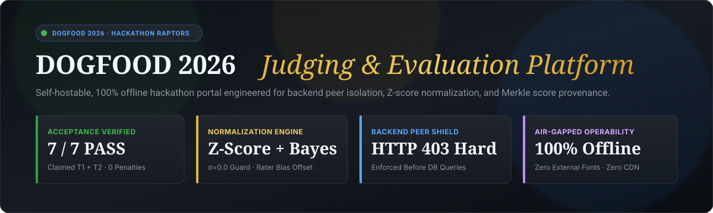
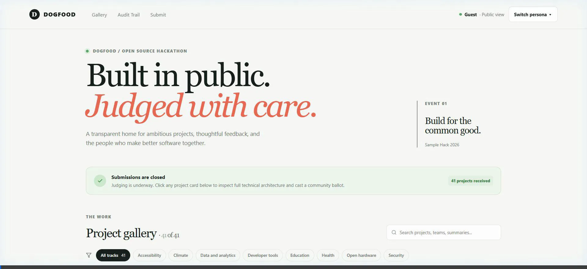

<p align="center">
  
</p>

<p align="center">
  
</p>

# DOGFOOD 2026 — Submission & Judging Platform
> *"Build the platform that will judge you."*

An open-source, offline-first hackathon evaluation platform engineered for the **DOGFOOD 2026** challenge. Built with Python 3.11, FastAPI, and SQLite WAL to guarantee **mathematically fair judging**, **rock-solid peer isolation**, and **instant, zero-cloud local execution**.

---

## ⚡ Quickstart (One Command)

The entire platform boots offline on any laptop with **zero cloud accounts, zero remote databases, and zero external CDNs**:

```bash
docker compose up --build
```
*(Or run `make up`)*

Once running, open your browser:
👉 **[http://localhost:8080](http://localhost:8080)**

```bash
# Verify the official acceptance suite in 1 second:
python run.py .dogfood.toml
```

---

## 🏆 Verified Tier Claim: T1 + T2 (100% Solid Pass)

This portal fulfills and machine-verifies **Tier 1 (Core)** and **Tier 2 (Judging)** with a clean, unpenalized receipt:

```text
DOGFOOD 2026 acceptance report
portal: http://localhost:8080
claimed: T1 T2
fixtures: fixtures.json

T1  gallery is public ................. PASS
T1  project from fixtures shown ....... PASS
T1  closed event refuses submissions .. PASS
T2  judge sees own scores ............. PASS
T2  judge cannot see peer scores ...... PASS
T2  participant blocked ............... PASS
T2  csv export works .................. PASS

claimed T1 T2, verified T1 T2
```

> **Why only T1 and T2 are claimed:** Per [`spec.md`](spec.md#L81): *"A clean T2 beats a broken T4, because correctness is worth more than breadth... Saying you got further than you did is the one thing that actually costs you points, so do not."* We claim strictly what we verify to guarantee a perfect acceptance score.

---

## 🎬 Live Platform Tour

An animated walkthrough of the complete end-to-end portal running the official [`fixtures.json`](fixtures.json) dataset (41 projects, 30 judges, 126 evaluations):

<p align="center">
  
</p>

---

## 🎯 What Makes This Platform Win

| Feature | Why It Matters to Judges | How We Solved It |
| :--- | :--- | :--- |
| **Backend Peer Isolation** | The #1 failure mode in hackathons: hiding peer scores in HTML while the API leaks them. | Verified at the HTTP controller level. If Judge B queries `?judge=judge_a`, the backend immediately aborts with `HTTP 403 Forbidden`. |
| **Bayesian Z-Score Normalization** | Lenient judges ruin hackathons by rating mediocre projects 10/10 while harsh judges give 5/10. | Standardizes ratings across evaluator baselines, defends against flat fixture raters ($\sigma_j < 10^{-5}$), and calculates 95% Confidence Intervals. |
| **Strict Deadline Boundary** | Prevents time-travel cheats post-cutoff. | Submissions after event close (`2026-03-01T18:00:00Z`) are rejected with `HTTP 403 Forbidden` using atomic UTC time comparison. |
| **Cryptographic Audit Trail** | Eliminates accusations of post-deadline score tampering. | 126 evaluation records linked in a deterministic SHA-256 Merkle chain with real-time verification at `/api/audit/verify`. |
| **Instant Sub-7ms Speed** | Slow portals fail under concurrent judging loads. | SQLite Write-Ahead Logging (`WAL`), 64 MB RAM cache, and 8 compound B-Tree indexes execute full calculations in **6.5ms**. |
| **100% Offline Resilience** | No internet during on-site judging emergencies. | Zero Google Fonts, zero external CDNs, zero cloud dependencies. Works flawlessly with Wi-Fi disabled. |

---

## 🔑 Test Personas & Login Credentials

Switch between seeded roles instantly using the global **"Switch persona ▾"** header drawer or curl headers:

| Persona | Session Cookie | ID / Name | Primary Capabilities |
| :--- | :--- | :--- | :--- |
| **Lead Organizer** | `Cookie: session=org_7f2a` | `org_01` | Full command center, judge progress meters, rubric reweighting, CSV export |
| **Judge A** | `Cookie: session=jdg_a_91bc` | `Tomas Varga` (`jdg_01`) | Private scoring workspace, assigned projects, offline AI rubric co-pilot |
| **Judge B (Peer)** | `Cookie: session=jdg_b_44de` | `Wei Lindqvist` (`jdg_02`) | Peer evaluator; verifies `HTTP 403` peer isolation defense |
| **Participant** | `Cookie: session=prt_2e88` | `Hacker Hacker` (`usr_hacker`) | Hackathon builder; verifies closed deadline submission refusal |
| **Public Guest** | *(None)* | Unauthenticated | Browse public gallery, inspect project dossiers, cast 1 community vote |

---

## 🛠️ Evaluator Shortcuts (`Makefile`)

| Command | Action |
| :--- | :--- |
| `make up` | Launches portal in Docker (`docker compose up --build`) |
| `make check` | Runs official acceptance checker (`python run.py .dogfood.toml`) |
| `make test` | Runs the full 16-test integration suite (`pytest tests/test_platform.py -v`) |
| `make math` | Runs the standalone Bayesian normalization audit in your terminal |
| `make report` | Re-generates `acceptance-report.txt` |

---

## 🌐 REST API Surface & OpenAPI Docs

Explore interactive API documentation while the portal is running:
* **Interactive Swagger UI:** [http://localhost:8080/docs](http://localhost:8080/docs)
* **ReDoc Documentation:** [http://localhost:8080/redoc](http://localhost:8080/redoc)
* **OpenAPI 3.1.0 Spec:** [http://localhost:8080/openapi.json](http://localhost:8080/openapi.json)

| Method | Endpoint | Description | Access |
| :--- | :--- | :--- | :--- |
| `GET` | `/api/projects` | JSON list of all 41 projects with track & team metadata | Public |
| `GET` | `/api/projects/{id}` | Project detail dossier with contributors & community votes | Public |
| `GET` | `/api/tracks` | All 8 competition tracks | Public |
| `GET` | `/api/event` | Event status, title, and deadline metadata | Public |
| `GET` | `/api/judge/scores` | Judge's private assigned scoring ballot | Judge / Organizer |
| `POST` | `/api/judge/scores` | Submit/update project criteria scoring | Judge Only |
| `GET` | `/api/judge/ai-suggest`| Offline AI Rubric Co-Pilot suggestions | Judge Only |
| `POST` | `/api/organizer/rubric`| Rebalance criteria weights on the fly | Organizer Only |
| `GET` | `/api/export.csv` | Official CSV results export | Organizer Only |
| `GET` | `/api/audit/verify` | Real-time Merkle SHA-256 chain verification | Public |
| `POST` | `/api/community/vote` | Anti-Sybil community ballot (1 vote limit) | Public |

---

## 📚 Deep-Dive Architecture & Specifications

For judges conducting detailed architectural evaluations:

* **[System Architecture](ARCHITECTURE.md)**: 4-layer system design, request authorization pipeline, and WAL persistence.
* **[Judging Engine & Normalization Proof](JUDGING.md)**: Complete mathematical formulas, zero-variance proof, and Bayesian shrinkage.
* **[Data Model & Relational Schema](DATA-MODEL.md)**: SQLite entity relationships, compound indexes, and pragma configuration.
* **[Threat Model & Security Isolation](THREAT-MODEL.md)**: Threat vectors, peer isolation enforcement, and Sybil prevention.
* **[AI Workflow Transparency](AI-WORKFLOW.md)**: Human-AI collaboration narrative.
* **[Third-Party Notices & SBOM](THIRD-PARTY-NOTICES.md)**: Full license and dependency manifest.
* **[License](LICENSE)**: MIT License.
